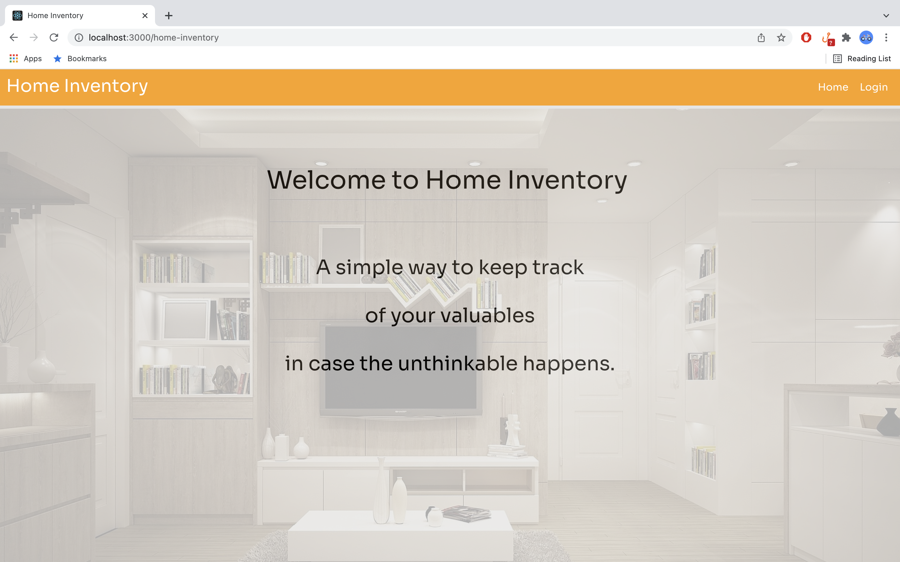
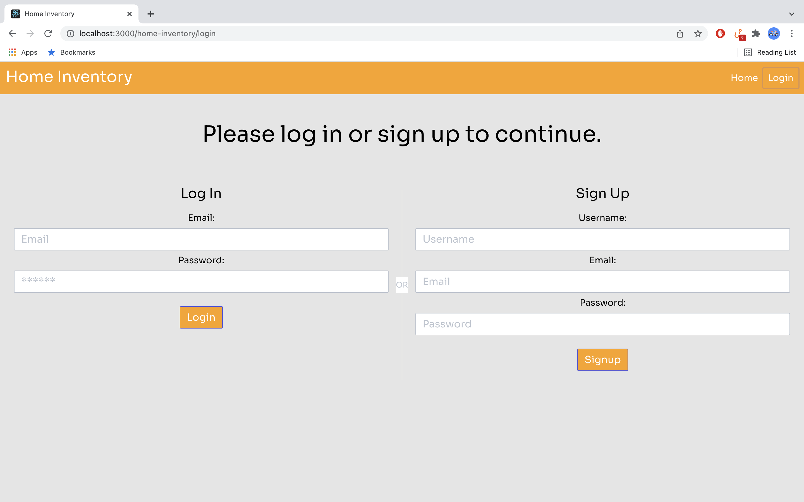
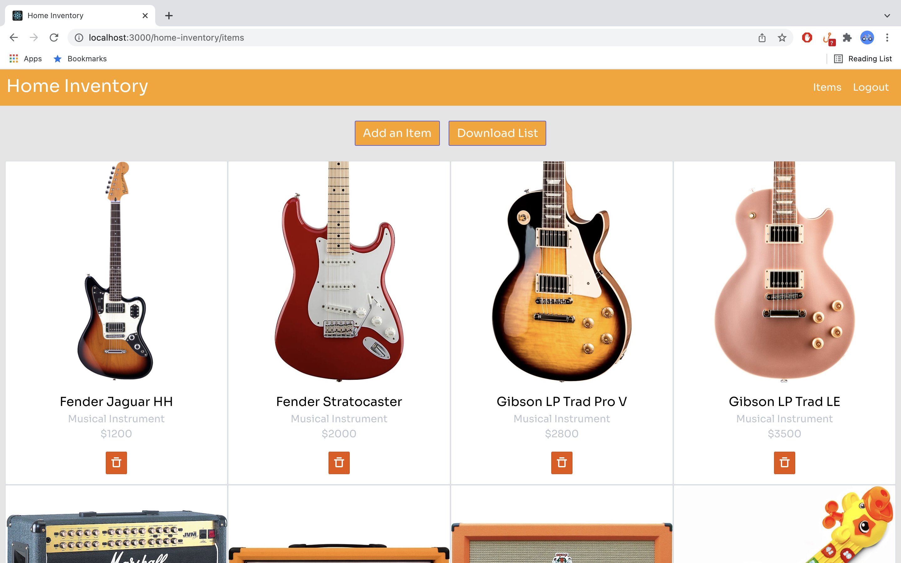
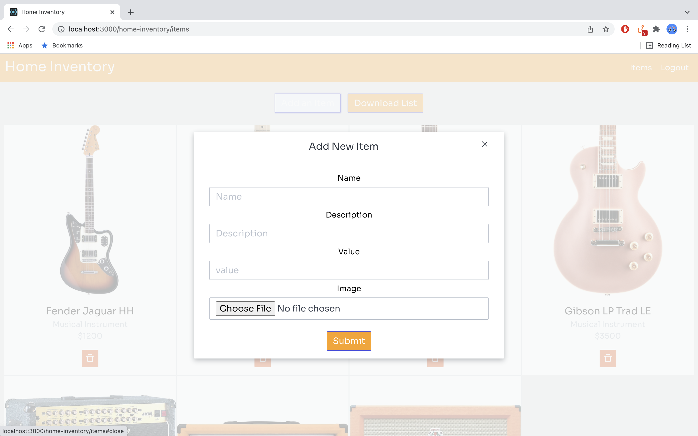
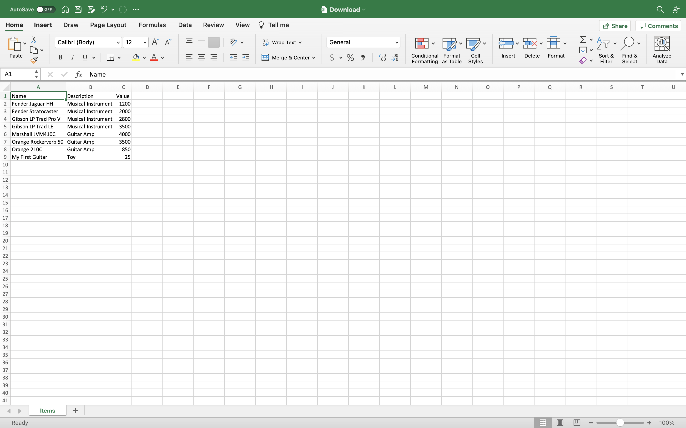

# Home Inventory
I created this app out of experience.  Years ago when I bought my first brand new house, I started moving in some new items a week before my move-in day.  The houses next to mine were still being built so I did not have neighbors yet.

When I arrived at the house the following weekend, all my new items were stolen.  Somebody broke in and took everything.

Fortunately, I still had all my receipts since the stolen items were recently purchased.  The insurance covered all my losses.

But what if I didn't have any record of them?  What if old items were stolen and I didn't even have pictures or old receipts?  The insurance company can easily reject your claim!

Enter Home Inventory...

This is a basic home inventory app to keep track of all the valuables in your home in case something like this happens to you.

It is so simple that anybody can use it.

It is built using React JS in the front-end with Express, Node JS and MongoDB in the back-end.

## Usage
- Users are required to signup/login to use the application.
- Click "Add an Item" to open the form to add an item.
- Enter the name, description, and value of the item.
- Choose a JPEG or PNG file to upload a photo of the item.
- After clicking submit, a new card will be added to the Items page.
- Click on the card's trash icon to delete an item.
- Click on "Download List" to export an XLS file of all items (photos excluded).

## Links
- Heroku:
- Github:

## Screenshots

